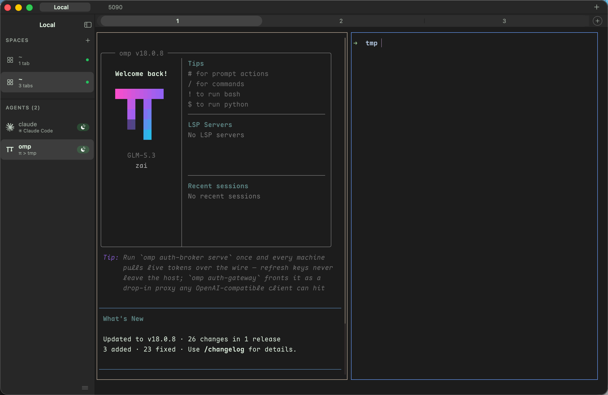

<div align="center">


### herdr-gui

**A native macOS window for herdr — mirrored sessions, agent sidebar, remote servers.**

<sub>Pure Swift · Native chrome on AppKit · Terminal core from Ghostty (libghostty)</sub>

<br />

[](#build-from-source)
[](LICENSE)

<br />



</div>

## Why

- **Native window, herdr semantics** — an AppKit sidebar and tab strip overlay herdr's own chrome; sessions, panes, agents, and keybinds underneath stay herdr
- **True mirror, not screen-scraping** — one embedded Ghostty surface renders the same app frame herdr's TUI renders: full snapshots rebaseline, diffs stream on top
- **Agent-aware sidebar** — 15 agent CLIs with icons, live status dots, a cwd/title second line per agent, one click to jump to its tab
- **Local & remote servers** — herdr on `~/.config/herdr/herdr.sock`, or any `~/.ssh/config` alias through a streamlocal tunnel¹; several servers in one window
- **Native settings** — theme, status indicators, sound, toasts, agent labels: written to `config.toml` with `server.reload_config`, exactly the TUI's write-then-reload flow
- **Reachability hook** — a menu-bar item toggles the window while your agents keep streaming in the background

## What's inside

| | |
|---|---|
| **Native chrome** | workspaces-over-agents sidebar (herdr's own split) · tab strip with inline rename & close (`tab.rename`) · collapsible sidebar with persisted width · <kbd>⌘ N</kbd> new session · <kbd>⇧⌘ W</kbd> close session · <kbd>⌘ ,</kbd> settings |
| **Mirror surface** | vendored libghostty · content-area crop driven by live grid metrics (mixed-DPI safe) · resize debounced to the server's grid |
| **Control plane** | NDJSON calls on `herdr.sock` (one request per connection) · a dedicated `events.subscribe` stream · snapshot → chrome reconcile, coalesced |
| **Display steering** | native clicks and keys ride herdr's documented keybindings over the attach stream: prefix chords (<kbd>⌃ B</kbd>), structured key events for modifier bindings, synthetic launcher clicks |
| **Input** | keyboard and mouse reporting routed over the attach stream · wheel gated by the focused pane's MouseCapture · a dedicated scroll channel for backpressure |
| **Servers** | pinned Local herdr page · plain local Terminal page · per-alias herdr mirror or ⌥ terminal-only SSH · `ssh -N -L` tunnels with a remote-`$HOME` probe |
| **Settings panel** | 18 themes (catppuccin, tokyo-night, dracula, nord, gruvbox, kanagawa, rose-pine, vesper, …) · writes `config.toml`, live reload into the mirror |
| **Theming** | chrome follows herdr's configured theme · terminal palette and themes imported from your Ghostty config on first launch |

Supported agent icons: Claude Code · Codex · Copilot · Cursor · Gemini · Qwen · Grok · Amp · Goose · Cline · Droid · Kimi · OpenCode · Oh My Pi · Pi

## Build from source

Requires macOS with a Swift toolchain (Xcode Command Line Tools) and a
running [herdr](https://herdr.dev) server — the agent multiplexer that
lives in your terminal:

```sh
cd swift-app
./build.sh        # → swift-app/herdr-gui
```

The binary runs against the vendored `CGhostty/lib/libghostty.dylib` via
rpath — keep them side by side. `python3` is optional: present, it regenerates
the icon tables from `Assets/`.

<sub>¹ Remote herdr mirrors ride OpenSSH streamlocal forwarding; this path is
not yet verified against a live remote server.</sub>

---

<div align="center">
<sub>

Terminal rendering on [Ghostty](https://ghostty.org)'s embedding API (libghostty) · [MPL-2.0](LICENSE)

</sub>
</div>
