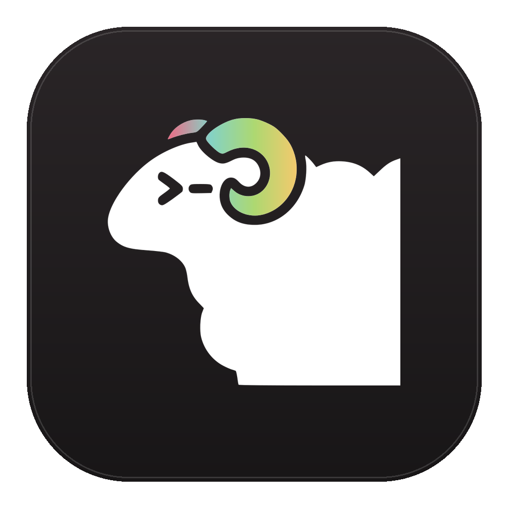

<div align="center">



### herdr-gui

**A native macOS window for herdr — endpoint protocol, agent sidebar, painted terminal cells.**

<sub>Pure Swift · Native chrome on AppKit · Terminal painted with CoreText from herdr's semantic cells</sub>

<br />

[](#build-from-source)
[](LICENSE)

<br />

</div>

## Why

- **Native window, herdr semantics** — an AppKit sidebar and tab strip project herdr's own snapshot model; sessions, panes, and agents underneath stay herdr
- **Endpoint generation 1** — herdr's stable client contract (0.9+): typed snapshots, semantic pane input, real navigation APIs. No TUI mirroring, no synthesized keybindings; herdr upgrades don't touch this GUI
- **Cell canvas, not a terminal emulator** — herdr renders cells server-side; this app paints them with CoreText, split panes included. **One terminal implementation everywhere**: even the standalone Terminal / ssh pages run their own private herdr session (no embedded emulator, no libghostty)
- **Agent-aware sidebar** — 15 agent CLIs with icons, live status dots, a cwd/title second line per agent, one click to jump to its tab
- **Your Ghostty themes** — the GUI theme picker parses Ghostty theme files directly (background/foreground/cursor/palette 0–15), from your Ghostty config, its bundled library, or the app's own copy

## What's inside

| | |
|---|---|
| **Protocol** | vendored endpoint gen1 wire (bincode 2, framed) from herdr upstream · handshake fail-closed on generation/codec mismatch · snapshot channel (JSON in `endpointControl`) · baseline surface patches applied atomically · single-lane API requests (`tab.focus`, `pane.split`, `layout.set_split_ratio`, …) |
| **Rendering** | `CellSurfaceView`: one CTLine per row, kern-pinned to the cell grid (~120× fewer draw calls) · content-keyed row-line cache (~440 fps on scroll floods, M1 Pro) · row-level dirty rects · named/indexed/RGB colors with reverse/dim/hidden blending · DECSCUSR cursor shapes · hyperlinks (hover + ⌘-click) · streaming pane-scoped selection + copy · centered popup overlay |
| **Splits** | ⌘D / ⇧⌘D create · right-click pane menu (split / zoom / close) · drag dividers (`layout.set_split_ratio`, 33 ms throttle) · ⌘⌥-arrows navigate |
| **Chrome** | workspaces-over-agents sidebar · tab strip with inline rename & close · ⌘, settings (daemon config.toml + GUI theme picker) |
| **Input** | semantic `ClientPaneInputEvent`: keys, IME text commits, mouse, wheel (fractional accumulator), paste — all pane-relative cells; the daemon decides scrollback/alternate-screen/app-mouse policy |
| **Lifecycle** | bounded-backoff reconnect · handshake rejections surface as readable offline state |
| **Servers** | pinned Local herdr page (endpoint gen1, herdr ≥ 0.9.0) · standalone Terminal page — a private per-page herdr server with its own sockets · plain ssh pages (private session + auto-typed `ssh <alias>`) · remote herdr pages wait for herdr's `remote-client-bridge` (next release) |

Supported agent icons: Claude Code · Codex · Copilot · Cursor · Gemini · Qwen · Grok · Amp · Goose · Cline · Droid · Kimi · OpenCode · Oh My Pi · Pi

## Protocol provenance

The wire declarations in `swift-app/Sources/Herdr/Endpoint/` mirror herdr's
`src/protocol/{wire,endpoint}.rs` (pinned upstream commit `856b64b9`, Apache-2.0)
as adapted client-side by [herdr-gpui](https://github.com/penso/herdr-gpui).
Field and variant order are compatibility contracts — see the comments there.
Handshake/snapshot fixtures in `swift-app/Tests/Fixtures/` are vendored from
the same source.

## Build from source

Requires macOS with a Swift toolchain (Xcode Command Line Tools), and a
running [herdr](https://herdr.dev) server **0.9.0 or newer**:

```sh
cd swift-app
./build.sh        # → swift-app/herdr-gui
```

No external frameworks or vendored dylibs — AppKit + CoreText only.
`python3` is optional: present, it regenerates the icon tables from `Assets/`.

Run the test suite (wire codec, handshake validation, session projection,
painter logic, snapshot adapter, theme parsing):

```sh
swift-app/tools/run-tests.sh
```

---

<div align="center">
<sub>
Endpoint protocol from [herdr](https://herdr.dev) · rendering references [herdr-gpui](https://github.com/penso/herdr-gpui) (Apache-2.0) · [MPL-2.0](LICENSE)
</sub>
</div>
